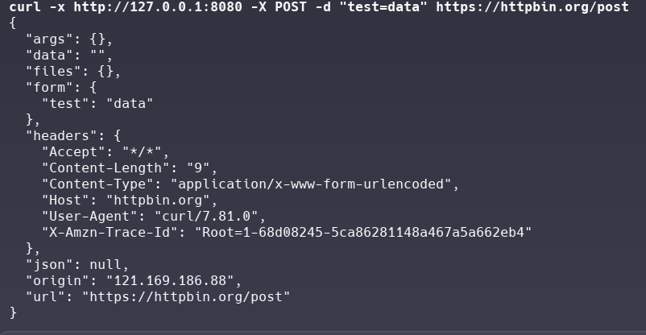

# VPN MITM Proxy

vpn proxy 동작을 학습용으로 개발한 WireGuard VPN 환경에서 HTTP/HTTPS 트래픽을 가로채고 분석하는 MITM(Man-in-the-Middle) 프록시 서버입니다.
(현재 WireGuard 트래픽을 가로채는 기능이 미완성 상태입니다.)

## 1. 프로젝트 빌드 및 실행 방법

### 의존성 설치

```bash
# Go 1.19 이상 설치 (Ubuntu/Debian)
sudo apt update
sudo apt install -y golang-go

# 또는 최신 버전 설치
wget https://go.dev/dl/go1.21.0.linux-amd64.tar.gz
sudo tar -C /usr/local -xzf go1.21.0.linux-amd64.tar.gz
echo 'export PATH=$PATH:/usr/local/go/bin' >> ~/.bashrc
source ~/.bashrc

# 기타 필요한 패키지
sudo apt install -y wireguard-tools iptables
```

### 빌드

```bash
cd toss-assinment
go build -o vpn-mitm-proxy .
```

### WireGuard 테스트 환경 설정

```bash
# WireGuard 테스트 환경 구축
chmod +x setup-wireguard-test.sh
sudo ./setup-wireguard-test.sh
```

이 스크립트는 다음을 수행합니다:
- wg0 (서버) 및 wg1 (클라이언트) 인터페이스 생성
- WireGuard 키 생성 및 설정
- 네트워크 연결 테스트

### Root CA 인증서 설치

```bash
# 프로그램 실행 후 CA 인증서 생성
sudo ./vpn-mitm-proxy -log-level DEBUG

# 다른 터미널에서 CA 인증서 설치
chmod +x install-ca.sh
sudo ./install-ca.sh
```

### 프로그램 실행

```bash
# 기본 설정으로 실행
sudo ./vpn-mitm-proxy

# 디버그 모드로 실행
sudo ./vpn-mitm-proxy -log-level DEBUG

# 커스텀 설정으로 실행
sudo ./vpn-mitm-proxy -iface wg0 -http-port 8080 -https-port 8443 -log-level DEBUG
```

## 2. 주요 기능 설명 및 구현 방식

### HTTP/HTTPS MITM 프록시

#### 기능
- HTTP/HTTPS 요청을 가로채고 Header, Request Body, Response Body를 로그에 출력
- 실시간 트래픽 모니터링 및 분석
- 동적 인증서 생성으로 HTTPS 트래픽 복호화

#### 구현 방식

**1. 아키텍처**
```
wg1 (클라이언트) → wg0 (서버) → MITM Proxy → 실제 서버
```

**2. 패킷 가로채기**
- TUN 인터페이스를 통해 WireGuard에서 복호화된 패킷 수신
- wg0 인터페이스에서 직접 패킷 스캔하여 HTTP/HTTPS 트래픽 감지
- 패킷 헤더 분석을 통해 HTTP(포트 80) 및 HTTPS(포트 443) 트래픽 식별
- 감지된 트래픽을 해당 HTTP/HTTPS 프록시로 직접 전달
- iptables 리디렉션 없이 애플리케이션 레벨에서 패킷 처리

**3. HTTP 프록시 처리**
- HTTP 요청/응답 헤더 및 본문 로깅
- 원본 서버로의 프록시 요청 전달

**4. HTTPS 프록시 처리**
- 동적 CA 인증서 생성 및 관리
- SNI(Server Name Indication) 추출을 통한 호스트별 인증서 생성
- TLS 핸드셰이크 가로채기 및 복호화
- 클라이언트와 원본 서버 간의 양방향 터널링

**5. 인증서 관리**
- Root CA 자동 생성
- 호스트별 동적 인증서 생성
- 인증서 캐싱으로 성능 최적화

## 3. 각 기능별 테스트 방법 및 결과

### HTTP MITM 프록시 테스트

```bash
# HTTP 요청 테스트
curl -x http://127.0.0.1:8080 -X POST -d "test=data" http://httpbin.org/post
```

**예상 결과:**
- 프록시 로그에 HTTP 요청/응답 헤더 및 본문 출력
- httpbin.org에서 정상적인 응답 수신

### HTTPS MITM 프록시 테스트

```bash
# HTTPS 요청 테스트 (CA 인증서 설치 후)
curl -x http://127.0.0.1:8080 -X POST -d "test=data" https://httpbin.org/post

# 또는 CA 인증서 무시하고 테스트
curl -k -x http://127.0.0.1:8080 -X POST -d "test=data" https://httpbin.org/post
```

**예상 결과:**
- 프록시 로그에 HTTPS 요청/응답 헤더 및 본문 출력
- TLS 핸드셰이크 성공
- httpbin.org에서 정상적인 응답 수신

### 로그 확인

프록시 실행 중 다음과 같은 로그를 확인할 수 있습니다:

```
[INFO] HTTP Request: POST /post -> httpbin.org:80
[INFO] Request Headers: Host: httpbin.org, User-Agent: curl/7.81.0, ...
[INFO] Response Headers: HTTP/1.1 200 OK, Content-Type: application/json, ...
[INFO] Response Body: {"args":{},"data":"test=data","files":{},...}
```

## 4. MITM 공격 성공 스크린샷
### 터미널

### 로그


## 5. 고려했던 문제점 및 해결 방안

### 초기 아키텍처 문제

**문제:** WireGuard 프로토콜 트래픽을 어떻게 받을까 고민
- VPN 서버 앞단에 배치: 개인키 없이 복호화 불가능
- VPN 서버 뒷단에 배치: WireGuard 프로토콜 트래픽 수신 불가

**해결 방안:**
- WireGuard Handshake 직접 구현 시도 → 구현 난이도 과도
- **최종 선택:** WireGuard Client(wg1), Server(wg0) 분리 구축
- wg0 인터페이스에서 복호화된 패킷을 읽어와 HTTP/HTTPS 프록시로 전달

### Root CA 인증 문제

**문제:** 프로그램에서 생성한 Root CA를 클라이언트가 신뢰하지 않음

**해결 방안:**
- `install-ca.sh` 스크립트로 시스템 CA 저장소에 자동 설치
- Ubuntu/Debian, Red Hat/CentOS 지원
- 브라우저별 수동 설치 가이드 제공

### wg1에서 wg0 연결 문제

**문제:** `curl --interface wg1 http://example.com`이 행걸리고 프로세스 로그에 아무것도 출력되지 않음

**시도한 해결책들:**
1. **NAT 설정**
   ```bash
   sudo iptables -t nat -A POSTROUTING -o eth0 -j MASQUERADE
   sudo iptables -A FORWARD -i wg1 -o wg0 -j ACCEPT
   ```

2. **iptables 규칙 수정**
   ```bash
   # PREROUTING 체인에서 -i wg0 → -o wg0 변경 시도
   # 결과: "Can't use -o with PREROUTING" 오류
   ```

3. **라우팅 설정**
   ```bash
   sudo ip route add default via 10.0.0.1 dev wg1
   ```

4. **TUN 인터페이스 생성 방식 변경**
   - 기존 인터페이스 사용 시도 → "interface already exists" 오류
   - 새로운 TUN 인터페이스 생성으로 변경

**최종 해결 하지 못함**
 - w1 인터페이스에서 w0 인터페이스로 트래픽이 가지 않는 근본적인 원인을 찾아내지 못했음

## 6. 개선 및 확장 방안

### 단기 개선사항

1. **TLS 인증서 캐시 추가**
   - 호스트별 인증서 캐싱으로 성능 향상
   - 메모리 사용량 최적화

2. **wg1에서 wg0 연결 문제 해결**

3. **로깅 시스템 개선**
   - 멀티쓰레드 환경에서 LogWriter 최적화를 통한 disk io 부하 감소
   - 로그 파일 로테이션

4. **다양한 프로토콜 지원**
   - HTTP/2,3 지원
   - WebSocket 트래픽 분석
   - gRPC 트래픽 모니터링

5**모니터링 및 분석**
   - 실시간 트래픽 대시보드
   - 통계 및 메트릭 수집
   - 이상 트래픽 탐지

6**배포 및 운영**
   - Docker 컨테이너화
   - 설정 파일 기반 구성
